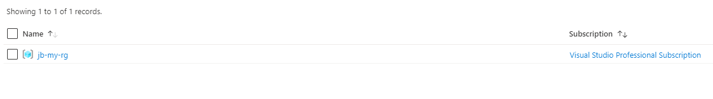

# Lab 01 - Connecting to Azure and Terraform Workflow

## Lab Overview

In this lab, you will use Terraform to create azure resources in your Azure subscription.

You will learn:

* Authentication with Azure using the Azure CLI
* The Terraform workflow

## Lab Exercise

### Create Terraform Configuration

Change directory into the folder specific to this lab.
For example: `cd terraform-workshop/lab_01/`.

Add a single Resource Group resource to `main.tf`. Replace `{PREFIX}` with your initials or something unique. i.e `jb-my-rg`
``` hcl
provider "azurerm" {
  features {}
}

resource "azurerm_resource_group" "main" {
  name     = "{PREFIX}-my-rg"
  location = "eastus"
}
```

> NOTE: It is critical that `{PREFIX}` is unique if you are sharing an Azure subscription.  Try using your initials or some other identifier.

### Authenticate To Azure

Login via the azure cli

```sh
az login

# Only needed if you have access to more than one Azure Subscription.
az account set -s "SUBSCRIPTION ID"
```

A helpful way to verify your set subscription is to use this azure cli command. IsDefault should be set equal to `true` for your desired subscription.

``` sh
az account list --output=table
```

> For documentation on other ways to authenticate, check out this [documentation](https://www.terraform.io/docs/providers/azurerm/guides/service_principal_client_secret.html)

### Run the Terraform Workflow

```sh
terraform init
```

<details><summary>View Output</summary>
<p>

```sh
$ terraform init

Initializing the backend...

Initializing provider plugins...
- Checking for available provider plugins...
- Downloading plugin for provider "azurerm" (hashicorp/azurerm) 2.22.0...

The following providers do not have any version constraints in configuration,
so the latest version was installed.

To prevent automatic upgrades to new major versions that may contain breaking
changes, it is recommended to add version = "..." constraints to the
corresponding provider blocks in configuration, with the constraint strings
suggested below.

* provider.azurerm: version = "~> 2.22"

Terraform has been successfully initialized!

You may now begin working with Terraform. Try running "terraform plan" to see
any changes that are required for your infrastructure. All Terraform commands
should now work.

If you ever set or change modules or backend configuration for Terraform,
rerun this command to reinitialize your working directory. If you forget, other
commands will detect it and remind you to do so if necessary.
```

</p>
</details>

---

``` sh
terraform plan
```

<details><summary>View Output</summary>
<p>

```sh
$ terraform plan
Refreshing Terraform state in-memory prior to plan...
The refreshed state will be used to calculate this plan, but will not be
persisted to local or remote state storage.


------------------------------------------------------------------------

An execution plan has been generated and is shown below.
Resource actions are indicated with the following symbols:
  + create

Terraform will perform the following actions:

  # azurerm_resource_group.main will be created
  + resource "azurerm_resource_group" "main" {
      + id       = (known after apply)
      + location = "eastus"
      + name     = "jb-my-rg"
    }

Plan: 1 to add, 0 to change, 0 to destroy.

------------------------------------------------------------------------

Note: You didn't specify an "-out" parameter to save this plan, so Terraform
can't guarantee that exactly these actions will be performed if
"terraform apply" is subsequently run.
```

</p>
</details>

---

``` sh
terraform apply
```
<details><summary>View Output</summary>
<p>

```sh
$ terraform apply

An execution plan has been generated and is shown below.
Resource actions are indicated with the following symbols:
  + create

Terraform will perform the following actions:

  # azurerm_resource_group.main will be created
  + resource "azurerm_resource_group" "main" {
      + id       = (known after apply)
      + location = "eastus"
      + name     = "jb-my-rg"
    }

Plan: 1 to add, 0 to change, 0 to destroy.

Do you want to perform these actions?
  Terraform will perform the actions described above.
  Only 'yes' will be accepted to approve.

  Enter a value: yes

azurerm_resource_group.main: Creating...
azurerm_resource_group.main: Creation complete after 1s [id=/subscriptions/6a3a86cc-566e-4d64-bb47-52ca7cf96384/resourceGroups/jb-my-rg]

Apply complete! Resources: 1 added, 0 changed, 0 destroyed.
```
</p>
</details>

### Verify in the Azure Portal

Navigate to the [Azure portal](https://portal.azure.com/) and verify the new resource group exists.



### Cleanup

When you are done, destroy the infrastructure.

Because the infrastructure is now managed by Terraform, we can destroy easily with a Terraform command.

Run a `terraform destroy` and follow the prompts to remove the infrastructure.

```sh
terraform destroy
```

<details><summary>View Output</summary>
<p>

```sh
$ terraform destroy
azurerm_resource_group.main: Refreshing state... [id=/subscriptions/6a3a86cc-566e-4d64-bb47-52ca7cf96384/resourceGroups/jb-my-rg]

An execution plan has been generated and is shown below.
Resource actions are indicated with the following symbols:
  - destroy

Terraform will perform the following actions:

  # azurerm_resource_group.main will be destroyed
  - resource "azurerm_resource_group" "main" {
      - id       = "/subscriptions/6a3a86cc-566e-4d64-bb47-52ca7cf96384/resourceGroups/jb-my-rg" -> null
      - location = "eastus" -> null
      - name     = "jb-my-rg" -> null
      - tags     = {} -> null
    }

Plan: 0 to add, 0 to change, 1 to destroy.

Do you really want to destroy all resources?
  Terraform will destroy all your managed infrastructure, as shown above.
  There is no undo. Only 'yes' will be accepted to confirm.

  Enter a value: yes

azurerm_resource_group.main: Destroying... [id=/subscriptions/6a3a86cc-566e-4d64-bb47-52ca7cf96384/resourceGroups/jb-my-rg]
azurerm_resource_group.main: Still destroying... [id=/subscriptions/6a3a86cc-566e-4d64-bb47-52ca7cf96384/resourceGroups/jb-my-rg, 10s elapsed]
azurerm_resource_group.main: Still destroying... [id=/subscriptions/6a3a86cc-566e-4d64-bb47-52ca7cf96384/resourceGroups/jb-my-rg, 20s elapsed]
azurerm_resource_group.main: Still destroying... [id=/subscriptions/6a3a86cc-566e-4d64-bb47-52ca7cf96384/resourceGroups/jb-my-rg, 30s elapsed]
azurerm_resource_group.main: Still destroying... [id=/subscriptions/6a3a86cc-566e-4d64-bb47-52ca7cf96384/resourceGroups/jb-my-rg, 40s elapsed]
azurerm_resource_group.main: Destruction complete after 47s

Destroy complete! Resources: 1 destroyed.
```
</p>
</details>

## Advanced areas to explore

  1. Run the plan command with the -out option and apply that output.
  2. Add tags to each resource.

## Next Steps

In the next lab, we are going to look at using data sources.  Execute the terraform plan and apply again for this resource group, and *do not* destroy the resource.  It will be used in the next lab.

## Resources

- [Terraform Azure Provider](https://www.terraform.io/docs/providers/azurerm/index.html)
- [AzureRM Resource Group](https://www.terraform.io/docs/providers/azurerm/r/resource_group.html)
- [Terraform Authentication](https://www.terraform.io/docs/providers/azurerm/guides/service_principal_client_secret.html)
