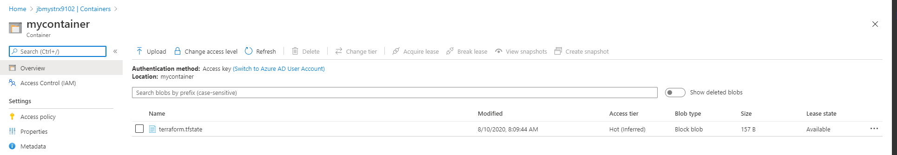
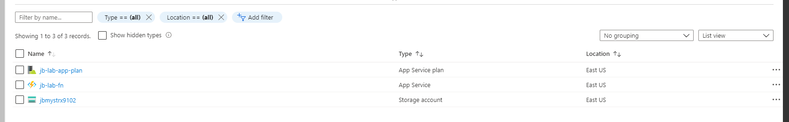

# Lab 03 - Remote State using Azure Backend

## Lab Overview

In this lab, you will learn:

* Deeper dive into Terraform state
* Setup remote state using Azure Backend
  
---

## Lab Exercise

### Get Started

* Change directory into a folder specific to this lab.
* For example: `cd terraform-workshop/lab_03/`
* Authenticate as instructed by [Lab 01]("../../../lab_01/README.md) if necessary
* Ensure that the resources created [Lab 02]("../../../lab_02/README.md) still exist

### Understanding Terraform state

Understanding Terraform state is one of the most important concepts to understand when learning to use Terraform in the real world.

Terraform must store state about your infrastructure and configuration. [Terraform state](https://www.terraform.io/docs/state/index.html) is used to map resources to the configuration, keep track of metadata, and improve performance.

By default, Terraform stores state locally in the `terraform.tfstate` file, but it can also be stored remotely, which works better in a team environment. In this lab, we are going to setup remote state and explore using Terraform in a team environment.

<details><summary>View Example State File</summary>
<p>

``` json
{
  "version": 4,
  "terraform_version": "0.12.28",
  "serial": 1,
  "lineage": "ff1a344f-b36d-52fb-e86b-968079a826d0",
  "outputs": {},
  "resources": [
    {
      "mode": "managed",
      "type": "azurerm_resource_group",
      "name": "main",
      "provider": "provider.azurerm",
      "instances": [
        {
          "schema_version": 0,
          "attributes": {
            "id": "/subscriptions/6a3a86cc-566e-4d64-bb47-52ca7cf96384/resourceGroups/jb-my-rg",
            "location": "eastus",
            "name": "jb-my-rg",
            "tags": {
              "terraform": "true"
            },
            "timeouts": null
          }
        }
        // ...
      ]
    }
  ]
}
```

</p>
</details>

### Add configuration for remote storage in Azure

This excercise uses the storage account and resource group from the previous lab to configure remote state.

The `main.tf` file has already been started for you in this lab.  Modify the backend block in `main.tf` so that it uses the resources defined in lab 02.  It should look similiar to the below configuration.

``` hcl
terraform {
    backend "azurerm" {
    resource_group_name  = "jb-my-rg"
    storage_account_name = "jbmystrx9102"
    container_name       = "mycontainer"
    key                  = "terraform.tfstate"
  }
}
```

### Run Terraform Workflow

```sh
terraform init
```

After initialization, you can see that the terraform.tfstate file is now located in the azure storage container instead of being stored on the local file system.



---

``` sh
terraform plan
```

<details><summary>View Output</summary>
<p>

```sh
$ terraform plan
Acquiring state lock. This may take a few moments...
Refreshing Terraform state in-memory prior to plan...
The refreshed state will be used to calculate this plan, but will not be
persisted to local or remote state storage.

data.azurerm_resource_group.example: Refreshing state...
data.azurerm_storage_account.example: Refreshing state...

------------------------------------------------------------------------

An execution plan has been generated and is shown below.  
Resource actions are indicated with the following symbols:
  + create

Terraform will perform the following actions:

  # azurerm_app_service_plan.example will be created      
  + resource "azurerm_app_service_plan" "example" {       
      + id                           = (known after apply)
      + kind                         = "FunctionApp"      
      + location                     = "eastus"
      + maximum_elastic_worker_count = (known after apply)
      + maximum_number_of_workers    = (known after apply)
      + name                         = "jb-lab-app-plan"
      + resource_group_name          = "jb-my-rg"

      + sku {
          + capacity = (known after apply)
          + size     = "Y1"
          + tier     = "Dynamic"
        }
    }

  # azurerm_function_app.example will be created
  + resource "azurerm_function_app" "example" {
      + app_service_plan_id            = (known after apply)
      + client_affinity_enabled        = (known after apply)
      + default_hostname               = (known after apply)
      + enable_builtin_logging         = true
      + enabled                        = true
      + https_only                     = false
      + id                             = (known after apply)
      + kind                           = (known after apply)
      + location                       = "eastus"
      + name                           = "jb-lab-fn"
      + outbound_ip_addresses          = (known after apply)
      + possible_outbound_ip_addresses = (known after apply)
      + resource_group_name            = "jb-my-rg"
      + site_credential                = (known after apply)
      + storage_account_access_key     = (sensitive value)
      + storage_account_name           = "jbmystrx9102"
      + storage_connection_string      = (sensitive value)
      + version                        = "~1"

      + auth_settings {
          + additional_login_params        = (known after apply)
          + allowed_external_redirect_urls = (known after apply)
          + default_provider               = (known after apply)
          + enabled                        = (known after apply)
          + issuer                         = (known after apply)
          + runtime_version                = (known after apply)
          + token_refresh_extension_hours  = (known after apply)
          + token_store_enabled            = (known after apply)
          + unauthenticated_client_action  = (known after apply)

          + active_directory {
              + allowed_audiences = (known after apply)
              + client_id         = (known after apply)
              + client_secret     = (sensitive value)
            }

          + facebook {
              + app_id       = (known after apply)
              + app_secret   = (sensitive value)
              + oauth_scopes = (known after apply)
            }

          + google {
              + client_id     = (known after apply)
              + client_secret = (sensitive value)
              + oauth_scopes  = (known after apply)
            }

          + microsoft {
              + client_id     = (known after apply)
              + client_secret = (sensitive value)
              + oauth_scopes  = (known after apply)
            }

          + twitter {
              + consumer_key    = (known after apply)
              + consumer_secret = (sensitive value)
            }
        }

      + connection_string {
          + name  = (known after apply)
          + type  = (known after apply)
          + value = (sensitive value)
        }

      + identity {
          + identity_ids = (known after apply)
          + principal_id = (known after apply)
          + tenant_id    = (known after apply)
          + type         = (known after apply)
        }

      + site_config {
          + always_on                 = (known after apply)
          + ftps_state                = (known after apply)
          + http2_enabled             = (known after apply)
          + ip_restriction            = (known after apply)
          + linux_fx_version          = (known after apply)
          + min_tls_version           = (known after apply)
          + pre_warmed_instance_count = (known after apply)
          + use_32_bit_worker_process = (known after apply)
          + websockets_enabled        = (known after apply)

          + cors {
              + allowed_origins     = (known after apply)
              + support_credentials = (known after apply)
            }
        }
    }

Plan: 2 to add, 0 to change, 0 to destroy.

------------------------------------------------------------------------

Note: You didn't specify an "-out" parameter to save this plan, so Terraform
can't guarantee that exactly these actions will be performed if
"terraform apply" is subsequently run.
```

</p>
</details>

---

``` sh
terraform apply
```

Notice that the Azure Backend is acquiring a lease on the blob storage.  This locks the state file so that only 1 apply can be made at a time.

*Note:* Sometimes the lease can get stuck or not unlocked.  If this happens, the lease needs to be manually broken. This can be done by selecting the blob and selecting the `Break Lease` option.

Explore the state file by navigating to the blob using the Azure Portal. Click on it and select the `Edit` tab.  Notice that all the resources are defined here.  

*IMPORTANT*
It is important to note that secrets such as access keys, passwords, etc are stored in plain text in the state file.  It is important to ensure that the state file is encrypted and access follows least privilege.

<details><summary>View Output</summary>
<p>

```sh
$ terraform apply

Acquiring state lock. This may take a few moments...
data.azurerm_resource_group.example: Refreshing state...
data.azurerm_storage_account.example: Refreshing state...

An execution plan has been generated and is shown below.  
Resource actions are indicated with the following symbols:
  + create

Terraform will perform the following actions:

  # azurerm_app_service_plan.example will be created      
  + resource "azurerm_app_service_plan" "example" {       
      + id                           = (known after apply)
      + kind                         = "FunctionApp"      
      + location                     = "eastus"
      + maximum_elastic_worker_count = (known after apply)
      + maximum_number_of_workers    = (known after apply)
      + name                         = "jb-lab-app-plan"  
      + resource_group_name          = "jb-my-rg"

      + sku {
          + capacity = (known after apply)
          + size     = "Y1"     
          + tier     = "Dynamic"
        }
    }

  # azurerm_function_app.example will be created
  + resource "azurerm_function_app" "example" {
      + app_service_plan_id            = (known after apply)
      + client_affinity_enabled        = (known after apply)
      + default_hostname               = (known after apply)
      + enable_builtin_logging         = true
      + enabled                        = true
      + https_only                     = false
      + id                             = (known after apply)
      + kind                           = (known after apply)
      + location                       = "eastus"
      + name                           = "jb-lab-fn"
      + outbound_ip_addresses          = (known after apply)
      + possible_outbound_ip_addresses = (known after apply)
      + resource_group_name            = "jb-my-rg"
      + site_credential                = (known after apply)
      + storage_account_access_key     = (sensitive value)
      + storage_account_name           = "jbmystrx9102"
      + storage_connection_string      = (sensitive value)
      + version                        = "~1"

      + auth_settings {
          + additional_login_params        = (known after apply)
          + allowed_external_redirect_urls = (known after apply)
          + default_provider               = (known after apply)
          + enabled                        = (known after apply)
          + issuer                         = (known after apply)
          + runtime_version                = (known after apply)
          + token_refresh_extension_hours  = (known after apply)
          + token_store_enabled            = (known after apply)
          + unauthenticated_client_action  = (known after apply)

          + active_directory {
              + allowed_audiences = (known after apply)
              + client_id         = (known after apply)
              + client_secret     = (sensitive value)
            }

          + facebook {
              + app_id       = (known after apply)
              + app_secret   = (sensitive value)
              + oauth_scopes = (known after apply)
            }

          + google {
              + client_id     = (known after apply)
              + client_secret = (sensitive value)
              + oauth_scopes  = (known after apply)
            }

          + microsoft {
              + client_id     = (known after apply)
              + client_secret = (sensitive value)
              + oauth_scopes  = (known after apply)
            }

          + twitter {
              + consumer_key    = (known after apply)
              + consumer_secret = (sensitive value)
            }
        }

      + connection_string {
          + name  = (known after apply)
          + type  = (known after apply)
          + value = (sensitive value)
        }

      + identity {
          + identity_ids = (known after apply)
          + principal_id = (known after apply)
          + tenant_id    = (known after apply)
          + type         = (known after apply)
        }

      + site_config {
          + always_on                 = (known after apply)
          + ftps_state                = (known after apply)
          + http2_enabled             = (known after apply)
          + ip_restriction            = (known after apply)
          + linux_fx_version          = (known after apply)
          + min_tls_version           = (known after apply)
          + pre_warmed_instance_count = (known after apply)
          + use_32_bit_worker_process = (known after apply)
          + websockets_enabled        = (known after apply)

          + cors {
              + allowed_origins     = (known after apply)
              + support_credentials = (known after apply)
            }
        }
    }

Plan: 2 to add, 0 to change, 0 to destroy.

Do you want to perform these actions?
  Terraform will perform the actions described above.
  Only 'yes' will be accepted to approve.

  Enter a value: yes

azurerm_app_service_plan.example: Creating...
azurerm_app_service_plan.example: Creation complete after 6s [id=/subscriptions/6a3a86cc-566e-4d64-bb47-52ca7cf96384/resourceGroups/jb-my-rg/providers/Microsoft.Web/serverfarms/jb-lab-app-plan]
azurerm_function_app.example: Creating...
azurerm_function_app.example: Still creating... [10s elapsed]
azurerm_function_app.example: Still creating... [20s elapsed]
azurerm_function_app.example: Still creating... [30s elapsed]
azurerm_function_app.example: Still creating... [40s elapsed]
azurerm_function_app.example: Still creating... [50s elapsed]
azurerm_function_app.example: Creation complete after 53s [id=/subscriptions/6a3a86cc-566e-4d64-bb47-52ca7cf96384/resourceGroups/jb-my-rg/providers/Microsoft.Web/sites/jb-lab-fn]
R
Apply complete! Resources: 2 added, 0 changed, 0 destroyed.
```

</p>
</details>



---

``` sh
terraform destroy
```

<details><summary>View Output</summary>
<p>

```sh
$ terraform destroy
Acquiring state lock. This may take a few moments...
data.azurerm_resource_group.example: Refreshing state...
data.azurerm_storage_account.example: Refreshing state...
azurerm_app_service_plan.example: Refreshing state... [id=/subscriptions/6a3a86cc-566e-4d64-bb47-52ca7cf96384/resourceGroups/jb-my-rg/providers/Microsoft.Web/serverfarms/jb-lab-app-plan]
azurerm_function_app.example: Refreshing state... [id=/subscriptions/6a3a86cc-566e-4d64-bb47-52ca7cf96384/resourceGroups/jb-my-rg/providers/Microsoft.Web/sites/jb-lab-fn]

An execution plan has been generated and is shown below.  
Resource actions are indicated with the following symbols:
  - destroy

Terraform will perform the following actions:

  # azurerm_app_service_plan.example will be destroyed    
  - resource "azurerm_app_service_plan" "example" {
      - id                           = "/subscriptions/6a3a86cc-566e-4d64-bb47-52ca7cf96384/resourceGroups/jb-my-rg/providers/Microsoft.Web/serverfarms/jb-lab-app-plan" -> null
      - is_xenon                     = false -> null
      - kind                         = "functionapp" -> null    
      - location                     = "eastus" -> null
      - maximum_elastic_worker_count = 1 -> null
      - maximum_number_of_workers    = 0 -> null
      - name                         = "jb-lab-app-plan" -> null
      - per_site_scaling             = false -> null
      - reserved                     = false -> null
      - resource_group_name          = "jb-my-rg" -> null
      - tags                         = {} -> null        

      - sku {
          - capacity = 0 -> null
          - size     = "Y1" -> null
          - tier     = "Dynamic" -> null
        }
    }

  # azurerm_function_app.example will be destroyed
  - resource "azurerm_function_app" "example" {
      - app_service_plan_id            = "/subscriptions/6a3a86cc-566e-4d64-bb47-52ca7cf96384/resourceGroups/jb-my-rg/providers/Microsoft.Web/serverfarms/jb-lab-app-plan" -> null
      - app_settings                   = {} -> null
      - client_affinity_enabled        = false -> null
      - daily_memory_time_quota        = 0 -> null
      - default_hostname               = "jb-lab-fn.azurewebsites.net" -> null
      - enable_builtin_logging         = true -> null
      - enabled                        = true -> null
      - https_only                     = false -> null
      - id                             = "/subscriptions/6a3a86cc-566e-4d64-bb47-52ca7cf96384/resourceGroups/jb-my-rg/providers/Microsoft.Web/sites/jb-lab-fn" -> null
      - kind                           = "functionapp" -> null
      - location                       = "eastus" -> null
      - name                           = "jb-lab-fn" -> null
      ...
      - resource_group_name            = "jb-my-rg" -> null
      - site_credential                = [
          - {
              - password = "gor3CC997XXxGynNYTqXXArAFqXXXXcXiJNwaDlXXXTb9xBy6Cy51pTbHpwb"
              - username = "$jb-lab-fn"
            },
        ] -> null
      - storage_account_access_key     = (sensitive value)
      - storage_account_name           = "jbmystrx9102" -> null
      - storage_connection_string      = (sensitive value)
      - tags                           = {} -> null
      - version                        = "~1" -> null

      - auth_settings {
          - additional_login_params        = {} -> null
          - allowed_external_redirect_urls = [] -> null
          - enabled                        = false -> null
          - token_refresh_extension_hours  = 0 -> null
          - token_store_enabled            = false -> null
        }

      - site_config {
          - always_on                 = false -> null
          - ftps_state                = "AllAllowed" -> null
          - http2_enabled             = false -> null
          - ip_restriction            = [] -> null
          - min_tls_version           = "1.2" -> null
          - pre_warmed_instance_count = 0 -> null
          - use_32_bit_worker_process = true -> null
          - websockets_enabled        = false -> null

          - cors {
              - allowed_origins     = [
                  - "https://functions-next.azure.com",
                  - "https://functions-staging.azure.com",
                  - "https://functions.azure.com",
                ] -> null
              - support_credentials = false -> null
            }
        }
    }

Plan: 0 to add, 0 to change, 2 to destroy.

Do you really want to destroy all resources?
  Terraform will destroy all your managed infrastructure, as shown above.
  There is no undo. Only 'yes' will be accepted to confirm.

  Enter a value: yes

azurerm_function_app.example: Destroying... [id=/subscriptions/6a3a86cc-566e-4d64-bb47-52ca7cf96384/resourceGroups/jb-my-rg/providers/Microsoft.Web/sites/jb-lab-fn]
azurerm_function_app.example: Destruction complete after 3s
azurerm_app_service_plan.example: Destroying... [id=/subscriptions/6a3a86cc-566e-4d64-bb47-52ca7cf96384/resourceGroups/jb-my-rg/providers/Microsoft.Web/serverfarms/jb-lab-app-plan]
azurerm_app_service_plan.example: Destruction complete after 3s

Destroy complete! Resources: 2 destroyed.
```

</p>
</details>

## Resources

* [Terraform State](https://www.terraform.io/docs/state/index.html)