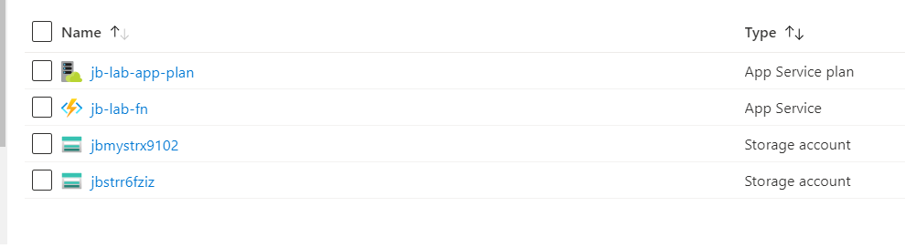

# Lab 04 - Modules

## Lab Overview

In this lab, you are going to take a look at Terraform modules and how to source them.

You will learn:

* What is a module
* How to create a module
* How to use module sources

## Lab Exercise

### Modules

A module is a container for multiple resources that can be used together.  Often times these are used to create lightweight abstractions that describe your infrastructure, or enforce cloud policies such a security and naming conventions.

Up until now, the labs have primarily used the main.tf file in the working directory.  All `.tf` files in the working directory are merged together to make the `root module`.

In this lab, we are going to use the `isolated azure function module`.  This module creates 3 resources and enforces our naming convention via local variables.  It also has 3 outputs so that other Terraform resources or modules can get access to the resource names.

> Note: Outputs to modules allow you to expose data

### Write configuration

Change directory into a folder specific to this lab. For example: cd terraform-workshop/lab_04/.

> Authenticate as instructed by Lab 01 if necessary  
Ensure remote state is enabled as instructed by lab 03

Open `main.tf` and add the following configuration.  

This configuration declares a module named `my_azure_function` (you can change this name if you like).  The module is sourced from the local file path and provides all required input variables such as prefix, location, and resource_group_name.

``` hcl
module "my_azure_function" {
    source = "../modules/isolated_azure_function"
    prefix = var.prefix
    location = data.azurerm_resource_group.example.location
    resource_group_name = data.resource_group_name.example.name
}
```

Next, add an output in `main.tf` to demonstrate accessing outputs from a module.

``` hcl
output "azure_function_name" {
    value = module.my_azure_function.azure_function_name
}
```

### Run Terraform Workflow

```sh
terraform init

Notice that when initializing Terraform the modules are downloaded.  When modules change Terraform needs to be re-initialized.

```
<details><summary>View Output</summary>
<p>

```sh
$ terraform init
Initializing modules...
- my_azure_function in ..\modules\isolated_azure_function

Initializing the backend...

Successfully configured the backend "azurerm"! Terraform will automatically
use this backend unless the backend configuration changes.

Initializing provider plugins...
- Checking for available provider plugins...
- Downloading plugin for provider "azurerm" (hashicorp/azurerm) 2.22.0...
- Downloading plugin for provider "random" (hashicorp/random) 2.3.0...

The following providers do not have any version constraints in configuration,
so the latest version was installed.

To prevent automatic upgrades to new major versions that may contain breaking
changes, it is recommended to add version = "..." constraints to the
corresponding provider blocks in configuration, with the constraint strings
suggested below.

* provider.azurerm: version = "~> 2.22"
* provider.random: version = "~> 2.3"

Terraform has been successfully initialized!

You may now begin working with Terraform. Try running "terraform plan" to see
any changes that are required for your infrastructure. All Terraform commands
should now work.

If you ever set or change modules or backend configuration for Terraform,
rerun this command to reinitialize your working directory. If you forget, other
commands will detect it and remind you to do so if necessary.
```

</p>
</details>

---

``` sh
terraform plan
```

<details><summary>View Output</summary>
<p>

```sh
$ terraform plan
Refreshing Terraform state in-memory prior to plan...
The refreshed state will be used to calculate this plan, but will not be
persisted to local or remote state storage.

data.azurerm_resource_group.example: Refreshing state...

------------------------------------------------------------------------

An execution plan has been generated and is shown below.
Resource actions are indicated with the following symbols:
  + create

Terraform will perform the following actions:

  # module.my_azure_function.azurerm_app_service_plan.module will be created
  + resource "azurerm_app_service_plan" "module" {
      + id                           = (known after apply)
      + kind                         = "FunctionApp"
      + location                     = "eastus"
      + maximum_elastic_worker_count = (known after apply)
      + maximum_number_of_workers    = (known after apply)
      + name                         = "jb-lab-app-plan"
      + resource_group_name          = "jb-my-rg"

      + sku {
          + capacity = (known after apply)
          + size     = "Y1"
          + tier     = "Dynamic"
        }
    }

  # module.my_azure_function.azurerm_function_app.module will be created
  + resource "azurerm_function_app" "module" {
      + app_service_plan_id            = (known after apply)
      + client_affinity_enabled        = (known after apply)
      + default_hostname               = (known after apply)
      + enable_builtin_logging         = true
      + enabled                        = true
      + https_only                     = false
      + id                             = (known after apply)
      + kind                           = (known after apply)
      + location                       = "eastus"
      + name                           = "jb-lab-fn"
      + outbound_ip_addresses          = (known after apply)
      + possible_outbound_ip_addresses = (known after apply)
      + resource_group_name            = "jb-my-rg"
      + site_credential                = (known after apply)
      + storage_account_access_key     = (sensitive value)
      + storage_account_name           = (known after apply)
      + storage_connection_string      = (sensitive value)
      + version                        = "~1"

      + auth_settings {
          + additional_login_params        = (known after apply)
          + allowed_external_redirect_urls = (known after apply)
          + default_provider               = (known after apply)
          + enabled                        = (known after apply)
          + issuer                         = (known after apply)
          + runtime_version                = (known after apply)
          + token_refresh_extension_hours  = (known after apply)
          + token_store_enabled            = (known after apply)
          + unauthenticated_client_action  = (known after apply)

          + active_directory {
              + allowed_audiences = (known after apply)
              + client_id         = (known after apply)
              + client_secret     = (sensitive value)
            }

          + facebook {
              + app_id       = (known after apply)
              + app_secret   = (sensitive value)
              + oauth_scopes = (known after apply)
            }

          + google {
              + client_id     = (known after apply)
              + client_secret = (sensitive value)
              + oauth_scopes  = (known after apply)
            }

          + microsoft {
              + client_id     = (known after apply)
              + client_secret = (sensitive value)
              + oauth_scopes  = (known after apply)
            }

          + twitter {
              + consumer_key    = (known after apply)
              + consumer_secret = (sensitive value)
            }
        }

      + connection_string {
          + name  = (known after apply)
          + type  = (known after apply)
          + value = (sensitive value)
        }

      + identity {
          + identity_ids = (known after apply)
          + principal_id = (known after apply)
          + tenant_id    = (known after apply)
          + type         = (known after apply)
        }

      + site_config {
          + always_on                 = (known after apply)
          + ftps_state                = (known after apply)
          + http2_enabled             = (known after apply)
          + ip_restriction            = (known after apply)
          + linux_fx_version          = (known after apply)
          + min_tls_version           = (known after apply)
          + pre_warmed_instance_count = (known after apply)
          + use_32_bit_worker_process = (known after apply)
          + websockets_enabled        = (known after apply)

          + cors {
              + allowed_origins     = (known after apply)
              + support_credentials = (known after apply)
            }
        }
    }

  # module.my_azure_function.azurerm_storage_account.module will be created
  + resource "azurerm_storage_account" "module" {
      + access_tier                      = (known after apply)
      + account_kind                     = "StorageV2"
      + account_replication_type         = "LRS"
      + account_tier                     = "Standard"
      + allow_blob_public_access         = false
      + enable_https_traffic_only        = true
      + id                               = (known after apply)
      + is_hns_enabled                   = false
      + location                         = "eastus"
      + min_tls_version                  = "TLS1_0"
      + name                             = (known after apply)
      + primary_access_key               = (sensitive value)
      + primary_blob_connection_string   = (sensitive value)
      + primary_blob_endpoint            = (known after apply)
      + primary_blob_host                = (known after apply)
      + primary_connection_string        = (sensitive value)
      + primary_dfs_endpoint             = (known after apply)
      + primary_dfs_host                 = (known after apply)
      + primary_file_endpoint            = (known after apply)
      + primary_file_host                = (known after apply)
      + primary_location                 = (known after apply)
      + primary_queue_endpoint           = (known after apply)
      + primary_queue_host               = (known after apply)
      + primary_table_endpoint           = (known after apply)
      + primary_table_host               = (known after apply)
      + primary_web_endpoint             = (known after apply)
      + primary_web_host                 = (known after apply)
      + resource_group_name              = "jb-my-rg"
      + secondary_access_key             = (sensitive value)
      + secondary_blob_connection_string = (sensitive value)
      + secondary_blob_endpoint          = (known after apply)
      + secondary_blob_host              = (known after apply)
      + secondary_connection_string      = (sensitive value)
      + secondary_dfs_endpoint           = (known after apply)
      + secondary_dfs_host               = (known after apply)
      + secondary_file_endpoint          = (known after apply)
      + secondary_file_host              = (known after apply)
      + secondary_location               = (known after apply)
      + secondary_queue_endpoint         = (known after apply)
      + secondary_queue_host             = (known after apply)
      + secondary_table_endpoint         = (known after apply)
      + secondary_table_host             = (known after apply)
      + secondary_web_endpoint           = (known after apply)
      + secondary_web_host               = (known after apply)

      + blob_properties {
          + cors_rule {
              + allowed_headers    = (known after apply)
              + allowed_methods    = (known after apply)
              + allowed_origins    = (known after apply)
              + exposed_headers    = (known after apply)
              + max_age_in_seconds = (known after apply)
            }

          + delete_retention_policy {
              + days = (known after apply)
            }
        }

      + identity {
          + principal_id = (known after apply)
          + tenant_id    = (known after apply)
          + type         = (known after apply)
        }

      + network_rules {
          + bypass                     = (known after apply)
          + default_action             = (known after apply)
          + ip_rules                   = (known after apply)
          + virtual_network_subnet_ids = (known after apply)
        }

      + queue_properties {
          + cors_rule {
              + allowed_headers    = (known after apply)
              + allowed_methods    = (known after apply)
              + allowed_origins    = (known after apply)
              + exposed_headers    = (known after apply)
              + max_age_in_seconds = (known after apply)
            }

          + hour_metrics {
              + enabled               = (known after apply)
              + include_apis          = (known after apply)
              + retention_policy_days = (known after apply)
              + version               = (known after apply)
            }

          + logging {
              + delete                = (known after apply)
              + read                  = (known after apply)
              + retention_policy_days = (known after apply)
              + version               = (known after apply)
              + write                 = (known after apply)
            }

          + minute_metrics {
              + enabled               = (known after apply)
              + include_apis          = (known after apply)
              + retention_policy_days = (known after apply)
              + version               = (known after apply)
            }
        }
    }

  # module.my_azure_function.random_string.module will be created
  + resource "random_string" "module" {
      + id          = (known after apply)
      + length      = 6
      + lower       = true
      + min_lower   = 0
      + min_numeric = 0
      + min_special = 0
      + min_upper   = 0
      + number      = true
      + result      = (known after apply)
      + special     = false
      + upper       = false
    }

Plan: 4 to add, 0 to change, 0 to destroy.

------------------------------------------------------------------------

Note: You didn't specify an "-out" parameter to save this plan, so Terraform
can't guarantee that exactly these actions will be performed if
"terraform apply" is subsequently run.
```

</p>
</details>

---

``` sh
terraform apply
```

<details><summary>View Output</summary>
<p>

```sh
$ terraform apply
Acquiring state lock. This may take a few moments...
data.azurerm_resource_group.example: Refreshing state...

An execution plan has been generated and is shown below.
Resource actions are indicated with the following symbols:
  + create

Terraform will perform the following actions:

  # module.my_azure_function.azurerm_app_service_plan.module will be created
  + resource "azurerm_app_service_plan" "module" {
      + id                           = (known after apply)
      + kind                         = "FunctionApp"
      + location                     = "eastus"
      + maximum_elastic_worker_count = (known after apply)
      + maximum_number_of_workers    = (known after apply)
      + name                         = "jb-lab-app-plan"
      + resource_group_name          = "jb-my-rg"

      + sku {
          + capacity = (known after apply)
          + size     = "Y1"
          + tier     = "Dynamic"
        }
    }

  # module.my_azure_function.azurerm_function_app.module will be created
  + resource "azurerm_function_app" "module" {
      + app_service_plan_id            = (known after apply)
      + client_affinity_enabled        = (known after apply)
      + default_hostname               = (known after apply)
      + enable_builtin_logging         = true
      + enabled                        = true
      + https_only                     = false
      + id                             = (known after apply)
      + kind                           = (known after apply)
      + location                       = "eastus"
      + name                           = "jb-lab-fn"
      + outbound_ip_addresses          = (known after apply)
      + possible_outbound_ip_addresses = (known after apply)
      + resource_group_name            = "jb-my-rg"
      + site_credential                = (known after apply)
      + storage_account_access_key     = (sensitive value)
      + storage_account_name           = (known after apply)
      + storage_connection_string      = (sensitive value)
      + version                        = "~1"

      + auth_settings {
          + additional_login_params        = (known after apply)
          + allowed_external_redirect_urls = (known after apply)
          + default_provider               = (known after apply)
          + enabled                        = (known after apply)
          + issuer                         = (known after apply)
          + runtime_version                = (known after apply)
          + token_refresh_extension_hours  = (known after apply)
          + token_store_enabled            = (known after apply)
          + unauthenticated_client_action  = (known after apply)

          + active_directory {
              + allowed_audiences = (known after apply)
              + client_id         = (known after apply)
              + client_secret     = (sensitive value)
            }

          + facebook {
              + app_id       = (known after apply)
              + app_secret   = (sensitive value)
              + oauth_scopes = (known after apply)
            }

          + google {
              + client_id     = (known after apply)
              + client_secret = (sensitive value)
              + oauth_scopes  = (known after apply)
            }

          + microsoft {
              + client_id     = (known after apply)
              + client_secret = (sensitive value)
              + oauth_scopes  = (known after apply)
            }

          + twitter {
              + consumer_key    = (known after apply)
              + consumer_secret = (sensitive value)
            }
        }

      + connection_string {
          + name  = (known after apply)
          + type  = (known after apply)
          + value = (sensitive value)
        }

      + identity {
          + identity_ids = (known after apply)
          + principal_id = (known after apply)
          + tenant_id    = (known after apply)
          + type         = (known after apply)
        }

      + site_config {
          + always_on                 = (known after apply)
          + ftps_state                = (known after apply)
          + http2_enabled             = (known after apply)
          + ip_restriction            = (known after apply)
          + linux_fx_version          = (known after apply)
          + min_tls_version           = (known after apply)
          + pre_warmed_instance_count = (known after apply)
          + use_32_bit_worker_process = (known after apply)
          + websockets_enabled        = (known after apply)

          + cors {
              + allowed_origins     = (known after apply)
              + support_credentials = (known after apply)
            }
        }
    }

  # module.my_azure_function.azurerm_storage_account.module will be created
  + resource "azurerm_storage_account" "module" {
      + access_tier                      = (known after apply)
      + account_kind                     = "StorageV2"
      + account_replication_type         = "LRS"
      + account_tier                     = "Standard"
      + allow_blob_public_access         = false
      + enable_https_traffic_only        = true
      + id                               = (known after apply)
      + is_hns_enabled                   = false
      + location                         = "eastus"
      + min_tls_version                  = "TLS1_0"
      + name                             = (known after apply)
      + primary_access_key               = (sensitive value)
      + primary_blob_connection_string   = (sensitive value)
      + primary_blob_endpoint            = (known after apply)
      + primary_blob_host                = (known after apply)
      + primary_connection_string        = (sensitive value)
      + primary_dfs_endpoint             = (known after apply)
      + primary_dfs_host                 = (known after apply)
      + primary_file_endpoint            = (known after apply)
      + primary_file_host                = (known after apply)
      + primary_location                 = (known after apply)
      + primary_queue_endpoint           = (known after apply)
      + primary_queue_host               = (known after apply)
      + primary_table_endpoint           = (known after apply)
      + primary_table_host               = (known after apply)
      + primary_web_endpoint             = (known after apply)
      + primary_web_host                 = (known after apply)
      + resource_group_name              = "jb-my-rg"
      + secondary_access_key             = (sensitive value)
      + secondary_blob_connection_string = (sensitive value)
      + secondary_blob_endpoint          = (known after apply)
      + secondary_blob_host              = (known after apply)
      + secondary_connection_string      = (sensitive value)
      + secondary_dfs_endpoint           = (known after apply)
      + secondary_dfs_host               = (known after apply)
      + secondary_file_endpoint          = (known after apply)
      + secondary_file_host              = (known after apply)
      + secondary_location               = (known after apply)
      + secondary_queue_endpoint         = (known after apply)
      + secondary_queue_host             = (known after apply)
      + secondary_table_endpoint         = (known after apply)
      + secondary_table_host             = (known after apply)
      + secondary_web_endpoint           = (known after apply)
      + secondary_web_host               = (known after apply)

      + blob_properties {
          + cors_rule {
              + allowed_headers    = (known after apply)
              + allowed_methods    = (known after apply)
              + allowed_origins    = (known after apply)
              + exposed_headers    = (known after apply)
              + max_age_in_seconds = (known after apply)
            }

          + delete_retention_policy {
              + days = (known after apply)
            }
        }

      + identity {
          + principal_id = (known after apply)
          + tenant_id    = (known after apply)
          + type         = (known after apply)
        }

      + network_rules {
          + bypass                     = (known after apply)
          + default_action             = (known after apply)
          + ip_rules                   = (known after apply)
          + virtual_network_subnet_ids = (known after apply)
        }

      + queue_properties {
          + cors_rule {
              + allowed_headers    = (known after apply)
              + allowed_methods    = (known after apply)
              + allowed_origins    = (known after apply)
              + exposed_headers    = (known after apply)
              + max_age_in_seconds = (known after apply)
            }

          + hour_metrics {
              + enabled               = (known after apply)
              + include_apis          = (known after apply)
              + retention_policy_days = (known after apply)
              + version               = (known after apply)
            }

          + logging {
              + delete                = (known after apply)
              + read                  = (known after apply)
              + retention_policy_days = (known after apply)
              + version               = (known after apply)
              + write                 = (known after apply)
            }

          + minute_metrics {
              + enabled               = (known after apply)
              + include_apis          = (known after apply)
              + retention_policy_days = (known after apply)
              + version               = (known after apply)
            }
        }
    }

  # module.my_azure_function.random_string.module will be created
  + resource "random_string" "module" {
      + id          = (known after apply)
      + length      = 6
      + lower       = true
      + min_lower   = 0
      + min_numeric = 0
      + min_special = 0
      + min_upper   = 0
      + number      = true
      + result      = (known after apply)
      + special     = false
      + upper       = false
    }

Plan: 4 to add, 0 to change, 0 to destroy.

Do you want to perform these actions?
  Terraform will perform the actions described above.
  Only 'yes' will be accepted to approve.

  Enter a value: yes

module.my_azure_function.random_string.module: Creating...
module.my_azure_function.random_string.module: Creation complete after 0s [id=r6fziz]
module.my_azure_function.azurerm_app_service_plan.module: Creating...
module.my_azure_function.azurerm_storage_account.module: Creating...
module.my_azure_function.azurerm_app_service_plan.module: Creation complete after 6s [id=/subscriptions/6a3a86cc-566e-4d64-bb47-52ca7cf96384/resourceGroups/jb-my-rg/providers/Microsoft.Web/serverfarms/jb-lab-app-plan]
module.my_azure_function.azurerm_storage_account.module: Still creating... [10s elapsed]
module.my_azure_function.azurerm_storage_account.module: Still creating... [20s elapsed]
module.my_azure_function.azurerm_storage_account.module: Creation complete after 22s [id=/subscriptions/6a3a86cc-566e-4d64-bb47-52ca7cf96384/resourceGroups/jb-my-rg/providers/Microsoft.Storage/storageAccounts/jbstrr6fziz]
module.my_azure_function.azurerm_function_app.module: Creating...
module.my_azure_function.azurerm_function_app.module: Still creating... [10s elapsed]
module.my_azure_function.azurerm_function_app.module: Still creating... [20s elapsed]
module.my_azure_function.azurerm_function_app.module: Still creating... [30s elapsed]
module.my_azure_function.azurerm_function_app.module: Still creating... [40s elapsed]
module.my_azure_function.azurerm_function_app.module: Still creating... [50s elapsed]
module.my_azure_function.azurerm_function_app.module: Creation complete after 52s [id=/subscriptions/6a3a86cc-566e-4d64-bb47-52ca7cf96384/resourceGroups/jb-my-rg/providers/Microsoft.Web/sites/jb-lab-fn]

Apply complete! Resources: 4 added, 0 changed, 0 destroyed.

Outputs:

azure_function_name = jb-lab-fn
```

</p>
</details>

## Validate Resources

Navigate to the Azure portal to validate that the resources were created.



---

## Clean Up

Clean up the resources using `terraform destroy`.


``` sh
terraform destroy
```

<details><summary>View Output</summary>
<p>

```sh
$ terraform destroy
Acquiring state lock. This may take a few moments...
module.my_azure_function.random_string.module: Refreshing state... [id=r6fziz]
data.azurerm_resource_group.example: Refreshing state...
module.my_azure_function.azurerm_app_service_plan.module: Refreshing state... [id=/subscriptions/6a3a86cc-566e-4d64-bb47-52ca7cf96384/resourceGroups/jb-my-rg/providers/Microsoft.Web/serverfarms/jb-lab-app-plan]
module.my_azure_function.azurerm_storage_account.module: Refreshing state... [id=/subscriptions/6a3a86cc-566e-4d64-bb47-52ca7cf96384/resourceGroups/jb-my-rg/providers/Microsoft.Storage/storageAccounts/jbstrr6fziz]
module.my_azure_function.azurerm_function_app.module: Refreshing state... [id=/subscriptions/6a3a86cc-566e-4d64-bb47-52ca7cf96384/resourceGroups/jb-my-rg/providers/Microsoft.Web/sites/jb-lab-fn]

An execution plan has been generated and is shown below.
Resource actions are indicated with the following symbols:
  - destroy

Terraform will perform the following actions:

  # module.my_azure_function.azurerm_app_service_plan.module will be destroyed
  - resource "azurerm_app_service_plan" "module" {
      - id                           = "/subscriptions/6a3a86cc-566e-4d64-bb47-52ca7cf96384/resourceGroups/jb-my-rg/providers/Microsoft.Web/serverfarms/jb-lab-app-plan" -> null
      - is_xenon                     = false -> null
      - kind                         = "functionapp" -> null
      - location                     = "eastus" -> null
      - maximum_elastic_worker_count = 1 -> null
      - maximum_number_of_workers    = 0 -> null
      - name                         = "jb-lab-app-plan" -> null
      - per_site_scaling             = false -> null
      - reserved                     = false -> null
      - resource_group_name          = "jb-my-rg" -> null
      - tags                         = {} -> null

      - sku {
          - capacity = 0 -> null
          - size     = "Y1" -> null
          - tier     = "Dynamic" -> null
        }
    }

  # module.my_azure_function.azurerm_function_app.module will be destroyed
  - resource "azurerm_function_app" "module" {
      - app_service_plan_id            = "/subscriptions/6a3a86cc-566e-4d64-bb47-52ca7cf96384/resourceGroups/jb-my-rg/providers/Microsoft.Web/serverfarms/jb-lab-app-plan" -> null
      - app_settings                   = {} -> null
      - client_affinity_enabled        = false -> null
      - daily_memory_time_quota        = 0 -> null
      - default_hostname               = "jb-lab-fn.azurewebsites.net" -> null
      - enable_builtin_logging         = true -> null
      - enabled                        = true -> null
      - https_only                     = false -> null
      - id                             = "/subscriptions/6a3a86cc-566e-4d64-bb47-52ca7cf96384/resourceGroups/jb-my-rg/providers/Microsoft.Web/sites/jb-lab-fn" -> null
      - kind                           = "functionapp" -> null
      - location                       = "eastus" -> null
      - name                           = "jb-lab-fn" -> null
      ...
      - resource_group_name            = "jb-my-rg" -> null
      - site_credential                = [
          - {
              - password = "oKHCT2CD7SwKSME4QLE5rTBtiimTHh197v1PBvwMhwZg5nnPDLgZ4tYoa7b2"
              - username = "$jb-lab-fn"
            },
        ] -> null
      - storage_account_access_key     = (sensitive value)
      - storage_account_name           = "jbstrr6fziz" -> null
      - storage_connection_string      = (sensitive value)
      - tags                           = {} -> null
      - version                        = "~1" -> null

      - auth_settings {
          - additional_login_params        = {} -> null
          - allowed_external_redirect_urls = [] -> null
          - enabled                        = false -> null
          - token_refresh_extension_hours  = 0 -> null
          - token_store_enabled            = false -> null
        }

      - site_config {
          - always_on                 = false -> null
          - ftps_state                = "AllAllowed" -> null
          - http2_enabled             = false -> null
          - ip_restriction            = [] -> null
          - min_tls_version           = "1.2" -> null
          - pre_warmed_instance_count = 0 -> null
          - use_32_bit_worker_process = true -> null
          - websockets_enabled        = false -> null

          - cors {
              - allowed_origins     = [
                  - "https://functions-next.azure.com",
                  - "https://functions-staging.azure.com",
                  - "https://functions.azure.com",
                ] -> null
              - support_credentials = false -> null
            }
        }
    }

  # module.my_azure_function.azurerm_storage_account.module will be destroyed
  - resource "azurerm_storage_account" "module" {
      - access_tier                    = "Hot" -> null
      - account_kind                   = "StorageV2" -> null
      - account_replication_type       = "LRS" -> null
      - account_tier                   = "Standard" -> null
      - allow_blob_public_access       = false -> null
      - enable_https_traffic_only      = true -> null
      - id                             = "/subscriptions/6a3a86cc-566e-4d64-bb47-52ca7cf96384/resourceGroups/jb-my-rg/providers/Microsoft.Storage/storageAccounts/jbstrr6fziz" -> null
      - is_hns_enabled                 = false -> null
      - location                       = "eastus" -> null
      - min_tls_version                = "TLS1_0" -> null
      - name                           = "jbstrr6fziz" -> null
      - primary_access_key             = (sensitive value)
      - primary_blob_connection_string = (sensitive value)
      - primary_blob_endpoint          = "https://jbstrr6fziz.blob.core.windows.net/" -> null
      - primary_blob_host              = "jbstrr6fziz.blob.core.windows.net" -> null
      - primary_connection_string      = (sensitive value)
      - primary_dfs_endpoint           = "https://jbstrr6fziz.dfs.core.windows.net/" -> null
      - primary_dfs_host               = "jbstrr6fziz.dfs.core.windows.net" -> null
      - primary_file_endpoint          = "https://jbstrr6fziz.file.core.windows.net/" -> null
      - primary_file_host              = "jbstrr6fziz.file.core.windows.net" -> null
      - primary_location               = "eastus" -> null
      - primary_queue_endpoint         = "https://jbstrr6fziz.queue.core.windows.net/" -> null
      - primary_queue_host             = "jbstrr6fziz.queue.core.windows.net" -> null
      - primary_table_endpoint         = "https://jbstrr6fziz.table.core.windows.net/" -> null
      - primary_table_host             = "jbstrr6fziz.table.core.windows.net" -> null
      - primary_web_endpoint           = "https://jbstrr6fziz.z13.web.core.windows.net/" -> null
      - primary_web_host               = "jbstrr6fziz.z13.web.core.windows.net" -> null
      - resource_group_name            = "jb-my-rg" -> null
      - secondary_access_key           = (sensitive value)
      - secondary_connection_string    = (sensitive value)
      - tags                           = {} -> null

      - network_rules {
          - bypass                     = [
              - "AzureServices",
            ] -> null
          - default_action             = "Allow" -> null
          - ip_rules                   = [] -> null
          - virtual_network_subnet_ids = [] -> null
        }

      - queue_properties {

          - hour_metrics {
              - enabled               = true -> null
              - include_apis          = true -> null
              - retention_policy_days = 7 -> null
              - version               = "1.0" -> null
            }

          - logging {
              - delete                = false -> null
              - read                  = false -> null
              - retention_policy_days = 0 -> null
              - version               = "1.0" -> null
              - write                 = false -> null
            }

          - minute_metrics {
              - enabled               = false -> null
              - include_apis          = false -> null
              - retention_policy_days = 0 -> null
              - version               = "1.0" -> null
            }
        }
    }

  # module.my_azure_function.random_string.module will be destroyed
  - resource "random_string" "module" {
      - id          = "r6fziz" -> null
      - length      = 6 -> null
      - lower       = true -> null
      - min_lower   = 0 -> null
      - min_numeric = 0 -> null
      - min_special = 0 -> null
      - min_upper   = 0 -> null
      - number      = true -> null
      - result      = "r6fziz" -> null
      - special     = false -> null
      - upper       = false -> null
    }

Plan: 0 to add, 0 to change, 4 to destroy.

Do you really want to destroy all resources?
  Terraform will destroy all your managed infrastructure, as shown above.
  There is no undo. Only 'yes' will be accepted to confirm.

  Enter a value: yes

module.my_azure_function.azurerm_function_app.module: Destroying... [id=/subscriptions/6a3a86cc-566e-4d64-bb47-52ca7cf96384/resourceGroups/jb-my-rg/providers/Microsoft.Web/sites/jb-lab-fn]
module.my_azure_function.azurerm_function_app.module: Destruction complete after 4s
module.my_azure_function.azurerm_app_service_plan.module: Destroying... [id=/subscriptions/6a3a86cc-566e-4d64-bb47-52ca7cf96384/resourceGroups/jb-my-rg/providers/Microsoft.Web/serverfarms/jb-lab-app-plan]
module.my_azure_function.azurerm_storage_account.module: Destroying... [id=/subscriptions/6a3a86cc-566e-4d64-bb47-52ca7cf96384/resourceGroups/jb-my-rg/providers/Microsoft.Storage/storageAccounts/jbstrr6fziz]
module.my_azure_function.azurerm_storage_account.module: Destruction complete after 3s
module.my_azure_function.random_string.module: Destroying... [id=r6fziz]
module.my_azure_function.random_string.module: Destruction complete after 0s
module.my_azure_function.azurerm_app_service_plan.module: Destruction complete after 3s

Destroy complete! Resources: 4 destroyed.
```
</p>
</details>

## Source Modules Using Github

Use the GitHub Module source to source the `isolated_azure_function` module from source control instead of the local file system.

``` hcl
module "my_azure_function" {
  source              = "github.com/joelbrinkley/terraform-workshop/lab_04/modules/isolated_azure_function"
  prefix              = var.prefix
  location            = data.azurerm_resource_group.example.location
  resource_group_name = data.azurerm_resource_group.example.name
}

```

## Advanced Areas to Explore

1. Use the [terraform destroy](https://www.terraform.io/docs/commands/destroy.html) -target option to destroy the module directly

## Resources

[Modules](https://www.terraform.io/docs/modules/index.html)
[Module Sources](https://www.terraform.io/docs/modules/sources.html)
[Random Provider](https://registry.terraform.io/providers/hashicorp/random/latest/docs)